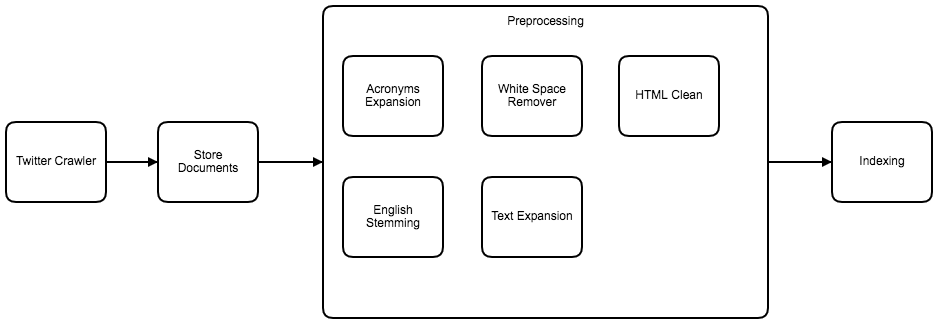

## Twitter information retrieval using web crawlers

Luiz Daniel Ramos França

- Twitter Crawler: the crawler will run through the twitter pages and store the links to later be saved.

- Store Documents: this part will get the links from the crawler and it will save the twittes.

- Preprocessing: 

  - Acronyms Expansion: as twittes are only 140-characters long, many people use acronyms on their texts. This module will expand those acronyms to its normal form.

  - HTML Clean: this part is responsible for removing the html tags

  - English Stemming: this part will reduce the words to it's lemma. 

  - Text Expansion: this module will expand the text.

- Indexing: this module will create an index of the twittes.

